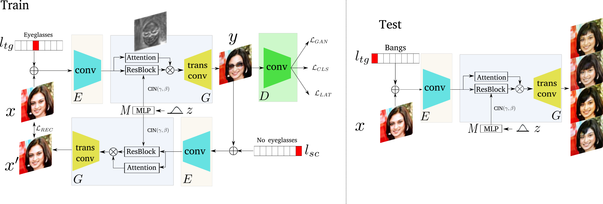
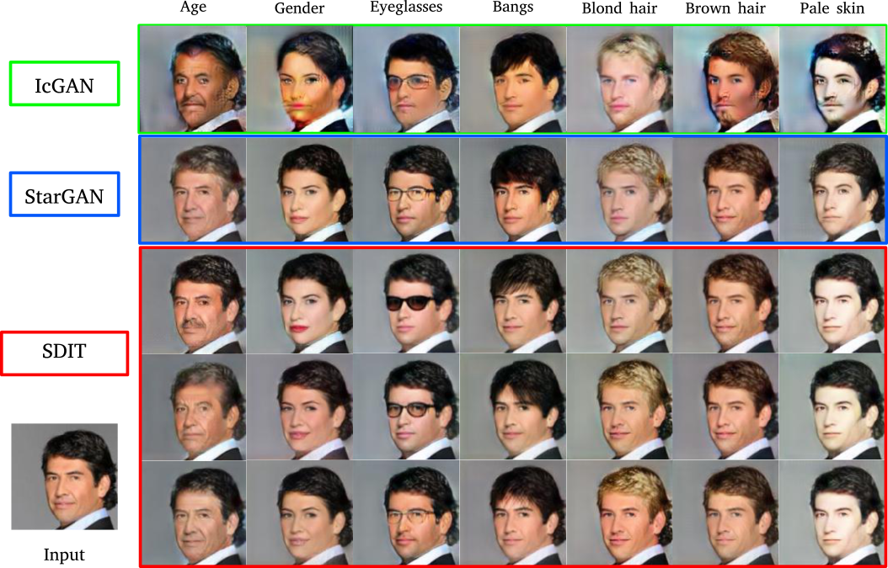

# Transferring GANs generating images from limited data
# Abstract: 
Recently, image-to-image translation research has witnessed remarkable progress. Although current approaches successfully generate diverse outputs or perform scalable image transfer, these properties have not been combined into a single method. To address this limitation, we propose SDIT: Scalable and Diverse image-to-image translation. These properties are combined into a single generator. The diversity is determined by a latent variable which is randomly sampled from a normal distribution.  The scalability is obtained by conditioning the network on the domain attributes. Additionally, we also exploit an attention mechanism that permits the generator to focus on the domain-specific attribute. We empirically demonstrate the performance of the proposed method on face mapping and other datasets beyond faces.
# Overview 
- [Dependences](#dependences)
- [Installation](#installtion)
- [Instructions](#instructions)
- [Framework](#Framework)
- [Results](#results)
- [References](#references)
- [Contact](#contact)
# Dependences 
- Python2.7, NumPy, SciPy, NVIDIA GPU
- **Pytorch:** the version is 0.4 (https://pytorch.org/)
- **Dataset:** CelebA or your dataset 

# Installation 
- Install pytorch 
# Instructions
- Using 'git clone https://github.com/yaxingwang/SDIT.git'

    You will get new folder whose name is 'SDIT' in your current path, then  use 'cd SDIT' to enter the downloaded new folder
    
- Download dataset or use your dataset.

- Run: 

  python main.py --mode train --dataset CelebA --celeba_image_dir data/celeba/images --attr_path data/celeba/list_attr_celeba.txt --image_size 128 --c_dim 5 --sample_dir results/samples --log_dir results/logs  --model_save_dir results/models --result_dir results/results --selected_attrs  Sideburns Bangs Blond_Hair Brown_Hair Male Eyeglasses  --lambda_noise 800 --attention True 

  If you want to get insight quickly, try: 

  python main.py --mode train --dataset CelebA --celeba_image_dir data/celeba/images --attr_path data/celeba/list_attr_celeba.txt --image_size 128 --c_dim 5 --sample_dir results/samples --log_dir results/logs  --model_save_dir results/models --result_dir results/results --selected_attrs  Sideburns Bangs Blond_Hair Brown_Hair Male Eyeglasses  --lambda_noise 0 --attention True 
 
# Framework 
 

# Results 
 

# References 
Our code  heavily rely on the following projects: 
- \[1\] 'StarGAN: Unified Generative Adversarial Networks for Multi-Domain Image-to-Image Translation' by Choi et. al, https://arxiv.org/abs/1711.09020, (https://github.com/yunjey/stargan)[code] 
- \[2\] 'MUNIT: Multimodal UNsupervised Image-to-image Translation' by Huang  et. al, https://arxiv.org/abs/1804.04732, (https://github.com/NVlabs/MUNIT) 

It would be helpful to understand this project if you are familiar with the above projects.
# Contact

If you run into any problems with this code, please submit a bug report on the Github site of the project. For another inquries pleace contact with me: yaxing@cvc.uab.es
